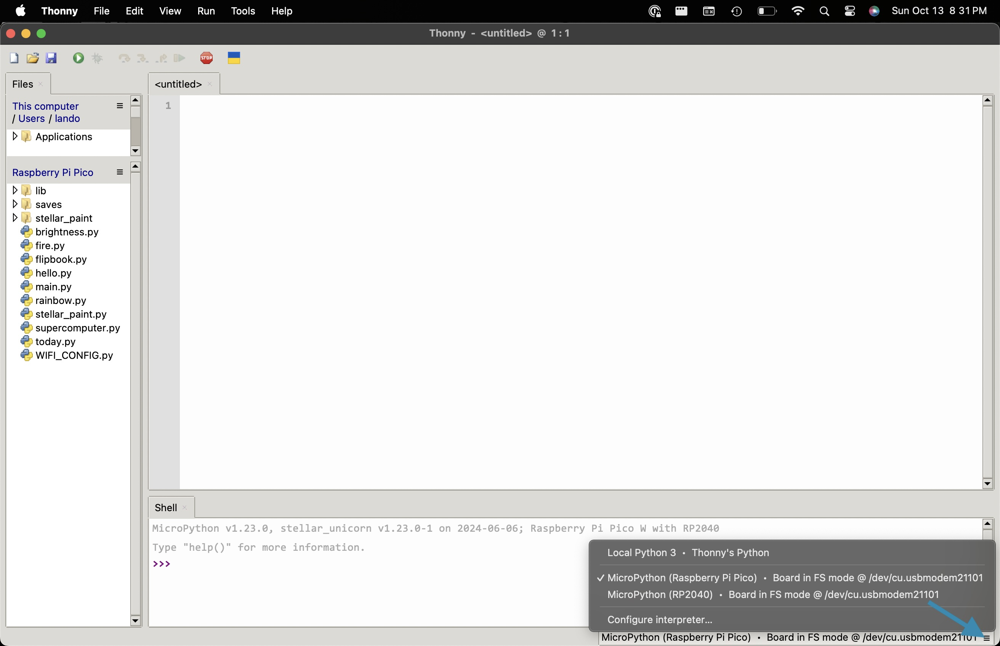
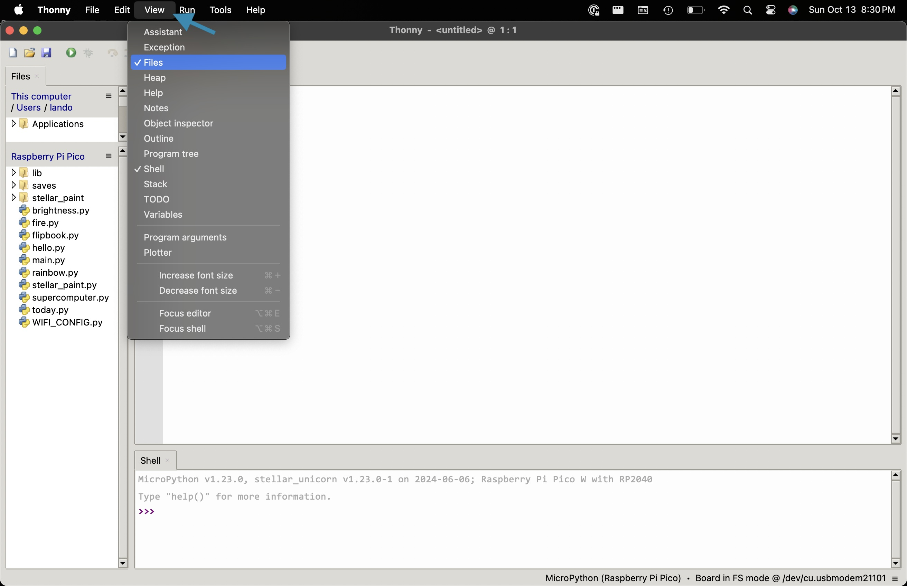
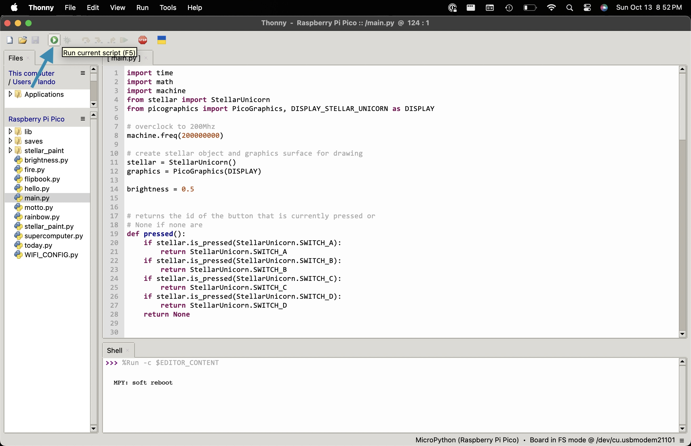
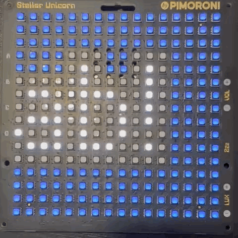

# Stellar Unicorn Piku Workshop

This is the setup and steps for the workshop run at SEA-Tech High School in Castle Hayne, NC on March 14, 2025 by Lando Toothman.

## :zap: Quick Start

> See [Pimoroni's Getting started with Raspberry Pi Pico Guide](https://learn.pimoroni.com/article/getting-started-with-pico) for a more detailed walkthrough for connecting Thonny to Raspberry Pi Pico.

Open Thonny and select the **"MicroPython (Raspberry Pi Pico)"** device from the menu in the bottom right corner.

In the Thonny menu, make sure **View > Files** is selected so that the device files are visible.

Double-click the [`main.py`](./main.py) file to open it in the Thonny file editor. Press the green play button to run the file on the Stellar Unicorn.

Press the green play button (or press the F5 key).

Your Stellar Unicorn will display a Pi-ku as scrolling text.

And ta-da! You're ready to start coding a Stellar Unicorn! :tada:

## :🥧: Creating a Pi-ku

1. Press the Stop button.
1. Open and run [`main.py`](./main.py).
1. Edit the syllables of your Pi-ku.
1. Watch your Pi-ku scroll across the screen!

### Challenge

1. (Easy) Update your Pi-ku to use more digits of pi.
1. (Medium) Open [`text_scroller.py`](./text_scroller.py) to figure out how to change the color of your Pi-ku.
